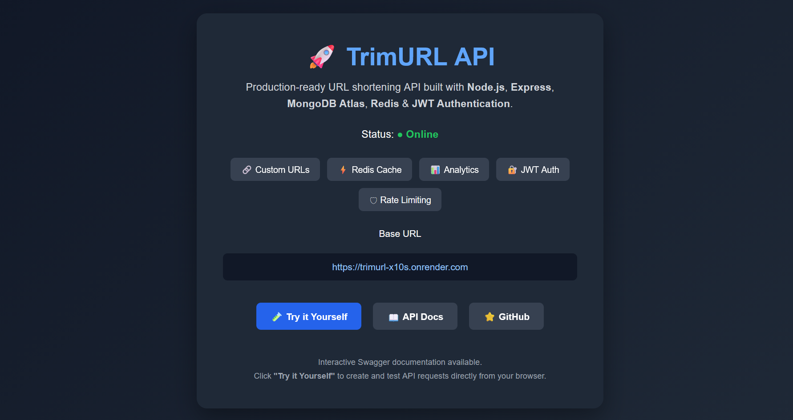
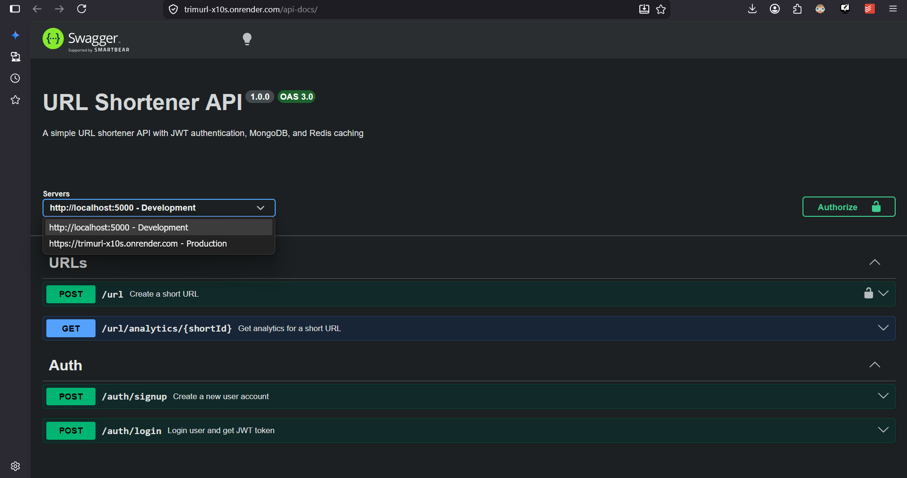
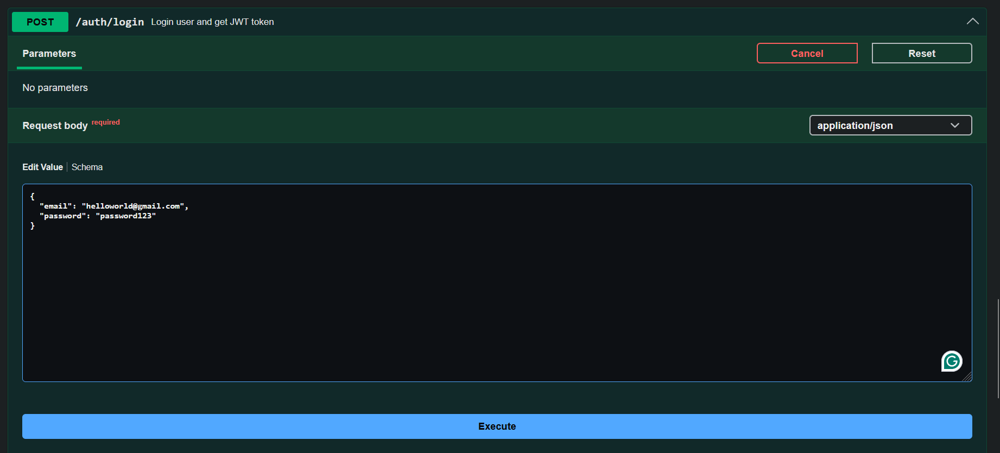
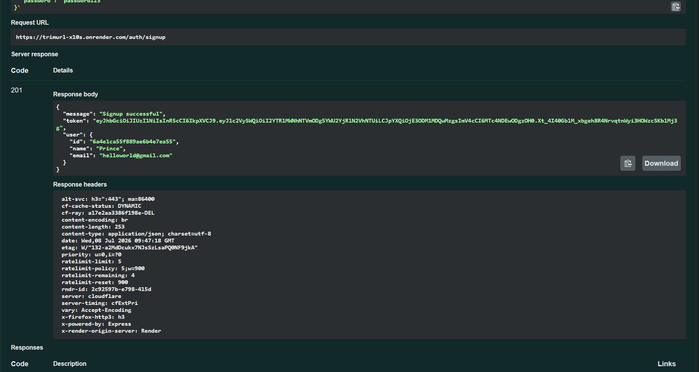
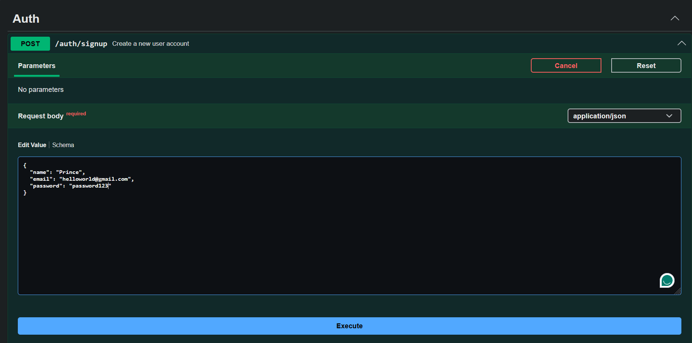
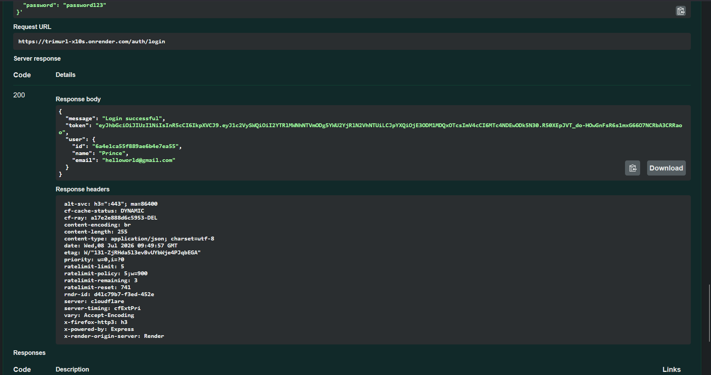
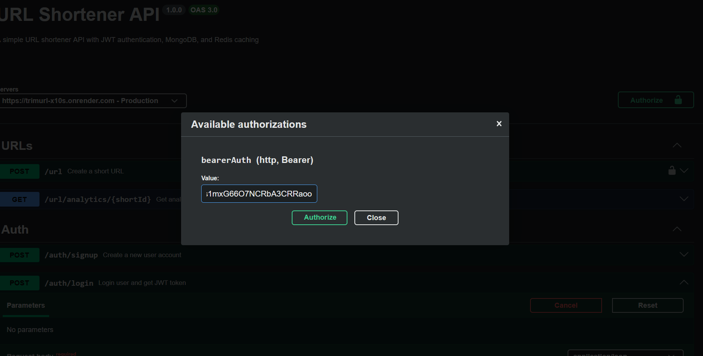
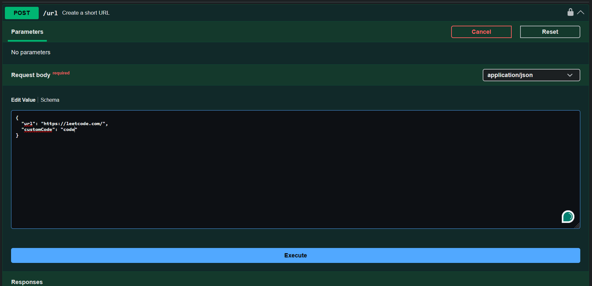
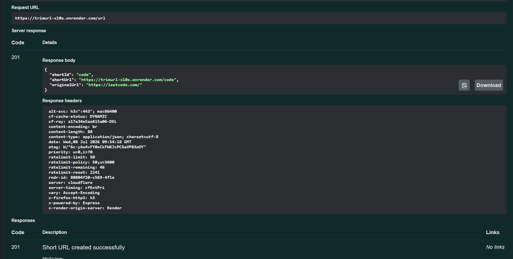

# 🚀 TrimURL

A production-ready URL Shortener API built with **Node.js, Express.js, MongoDB Atlas, Redis, and JWT Authentication**.

TrimURL allows users to generate random or custom short URLs, securely manage them using JWT authentication, track click analytics, and leverage Redis caching for faster redirects.

---

## 🌐 Live Demo

**API Base URL**

https://trimurl-x10s.onrender.com

**Swagger Documentation**

https://trimurl-x10s.onrender.com/api-docs

---

## Architecture

Browser / Client
│
▼
Express Routes
│
▼
Authentication
Rate Limiter
Validation
│
▼
Controllers
│ │
▼ ▼
Redis MongoDB
│ │
└──► Response

---

## ✨ Features

### 🔐 Authentication

- JWT-based authentication
- Secure password hashing using bcryptjs
- User Signup & Login
- Protected routes
- Per-IP authentication rate limiting

### 🔗 URL Shortening

- Generate random short URLs
- Create custom short URLs of your choice
- Associate URLs with authenticated users
- Automatic click counting
- HTTP redirects

### 📊 Analytics

- Total click tracking
- Creation timestamp
- Original URL details

### ⚡ Performance

- Redis caching
- Cache-aside pattern
- 1-hour TTL for cached URLs

### 🛡 Security

- JWT validation middleware
- Password hashing
- Rate limiting
- Input validation

### 📖 API Documentation

- Interactive Swagger UI
- Live endpoint testing
- Request/Response schemas

---

## 🛠 Tech Stack

| Category        | Technologies        |
| --------------- | ------------------- |
| Backend         | Node.js, Express.js |
| Database        | MongoDB Atlas       |
| Cache           | Redis               |
| Authentication  | JWT, bcryptjs       |
| Documentation   | Swagger (OpenAPI)   |
| Deployment      | Render              |
| Version Control | Git & GitHub        |

---

## 📸 Screenshots ( Follow these steps in order )

### 1. Landing Page

https://trimurl-x10s.onrender.com



---

### 2. Swagger API Documentation

https://trimurl-x10s.onrender.com/api-docs



---

### 3. User Signup - Step 1



---

### 4. User Signup - Step 2



---

### 5. User Login - Step 1



---

### 6. User Login - Step 2



---

### 7. Authorization (JWT Token)



---

### 8. Create Short URL - Step 1



---

### 9. Short URL Result



---


## 📚 API Endpoints

| Method | Endpoint                  | Description              | Auth |
| ------ | ------------------------- | ------------------------ | ---- |
| POST   | `/auth/signup`            | Register a new user      | ❌   |
| POST   | `/auth/login`             | Login & receive JWT      | ❌   |
| POST   | `/url`                    | Create a short URL       | ✅   |
| GET    | `/:shortId`               | Redirect to original URL | ❌   |
| GET    | `/url/analytics/:shortId` | View analytics           | ❌   |

---

## 🚀 Getting Started

### Clone Repository

```bash
git clone https://github.com/princeaggarwal2005/trimurl.git

cd trimurl
```

### Install Dependencies

```bash
npm install
```

### Configure Environment Variables

Create a `.env` file.

```env
PORT=5000

MONGO_URI=your_mongodb_connection_string

REDIS_URL=your_redis_connection_string

JWT_SECRET=your_secret_key

BASE_URL=http://localhost:5000
```

### Start Development Server

```bash
npm run dev
```

or

```bash
npm start
```

---

## 🏗 Project Structure

```text
backend/
│
├── config/
├── controllers/
├── db/
├── middleware/
├── models/
├── routes/
├── utils/
├── app.js
└── index.js
```

---

## 🔄 Request Flow

```text
Client
   │
   ▼
Express Routes
   │
   ▼
Middlewares
(Auth • Validation • Rate Limiter)
   │
   ▼
Controllers
   │
   ├── MongoDB
   └── Redis Cache
   │
   ▼
Response
```

---

## 📈 Future Improvements

- QR Code generation
- URL expiration
- User dashboard
- Docker Compose
- Unit & Integration Tests
- CI/CD Pipeline
- Custom Domains
- Link Editing
- URL Search & Filtering

---

## 👨‍💻 Author

**Prince Aggarwal**

GitHub:
https://github.com/princeaggarwal2005

LinkedIn:
https://www.linkedin.com/in/prince-aggarwal-b00864321/

---

## ⭐ Support

If you found this project useful, consider giving it a ⭐ on GitHub.
